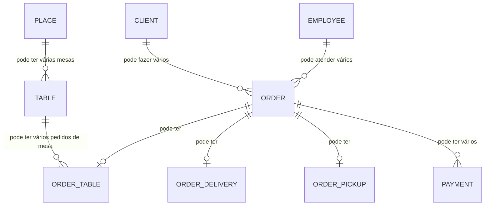

# BACKEND_OVERVIEW.md

## Visão Geral

Este backend implementa o sistema de vendas para restaurantes, lanchonetes e similares, suportando pedidos de mesa, delivery e retirada. O sistema é escrito em Go, com arquitetura modular, DTOs, repositórios e forte separação de domínios.

---

## Principais Entidades

- **Order**: Entidade central, representa um pedido. Pode ser de mesa, delivery ou retirada.
- **OrderTable**: Dados específicos de pedidos de mesa (mesa física, status, tax_rate, etc).
- **OrderDelivery**: Dados específicos de pedidos de delivery (cliente, endereço, taxa de entrega, etc).
- **OrderPickup**: Dados específicos de pedidos de retirada (nome, status, etc).
- **Employee, Client, Product, Payment, GroupItem, Company, Table, Place, etc.**

---

## Relações Entre Entidades



---

## Fluxos Principais

### Criação de Pedido
1. Usuário seleciona tipo de pedido (mesa, delivery, retirada)
2. Sistema cria um Order e associa ao tipo específico (OrderTable, OrderDelivery, OrderPickup)
3. Pedido recebe um `order_number` sequencial
4. Itens, pagamentos e status são gerenciados conforme o tipo

### Fechamento/Cancelamento
- Pagamentos são validados antes de fechar
- Status e logs de tempo são atualizados
- Mesas são liberadas ao fechar/cancelar

---

## Padrões de Nomenclatura
- **Go structs:** PascalCase (Order, OrderTable, OrderDelivery...)
- **Campos no banco/JSON:** snake_case (order_number, created_at...)
- **DTOs:** Seguem o padrão das entidades, mas adaptados para transporte

---

## Endpoints Principais (REST)

- `POST   /order-table/new`           - Cria pedido de mesa
- `POST   /order-delivery/new`        - Cria pedido de delivery
- `POST   /order-pickup/new`          - Cria pedido de retirada
- `GET    /order-table/{id}`          - Busca pedido de mesa por ID
- `GET    /order-delivery/{id}`       - Busca pedido de delivery por ID
- `GET    /order-pickup/{id}`         - Busca pedido de retirada por ID
- `POST   /order-table/update/change-table/{id}` - Troca a mesa de um pedido
- `POST   /order-table/update/close/{id}`        - Fecha pedido de mesa
- `POST   /order-table/update/cancel/{id}`       - Cancela pedido de mesa
- ...

---

## Dependências Externas
- **Banco de Dados:** PostgreSQL (padrão), suporte a local (mapa em memória) para testes
- **ORM:** Bun
- **UUID:** github.com/google/uuid
- **Decimal:** github.com/shopspring/decimal
- **Autenticação:** (pode ser detalhado se houver)

---

## Pontos de Atenção
- **OrderNumber**: Sempre gerado sequencialmente, copiado para OrderTable, OrderDelivery, OrderPickup
- **Status:** Cada tipo de pedido tem seu próprio enum de status
- **Soft Delete:** Algumas entidades suportam soft delete
- **Transações:** Operações críticas usam transação para consistência

---

## Como rodar/testar

```sh
docker-compose up
# ou
cd sales-backend-golang
GO111MODULE=on go run cmd/httpserver.go
```

---

## Observações
- Sempre consulte este arquivo para entender as relações e fluxos antes de alterar regras de negócio ou entidades principais.
- Atualize este overview sempre que houver mudanças estruturais relevantes! 